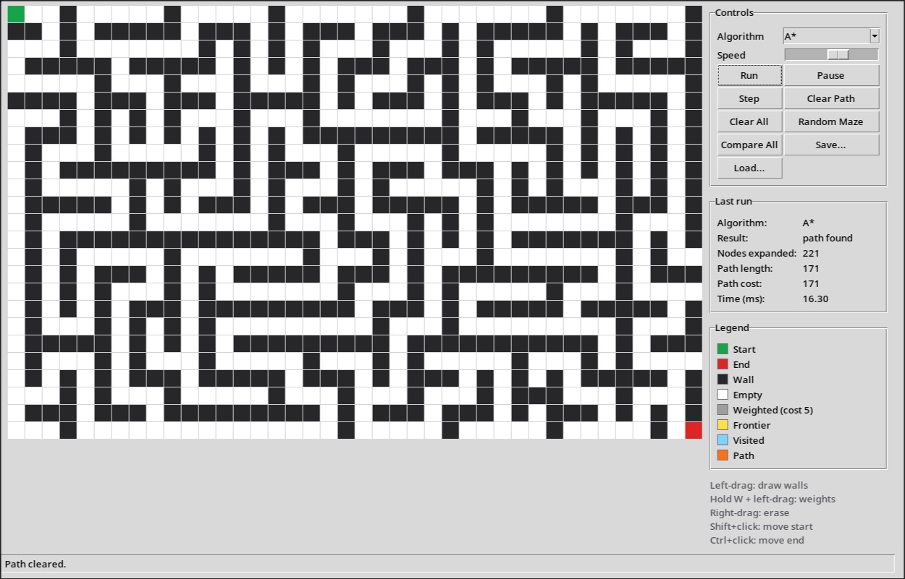
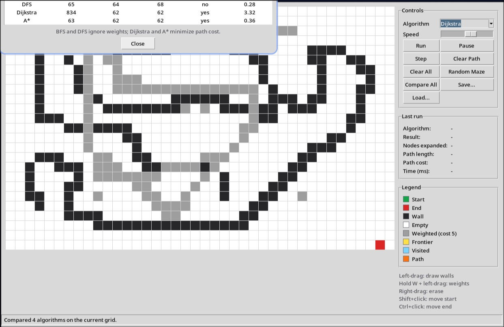
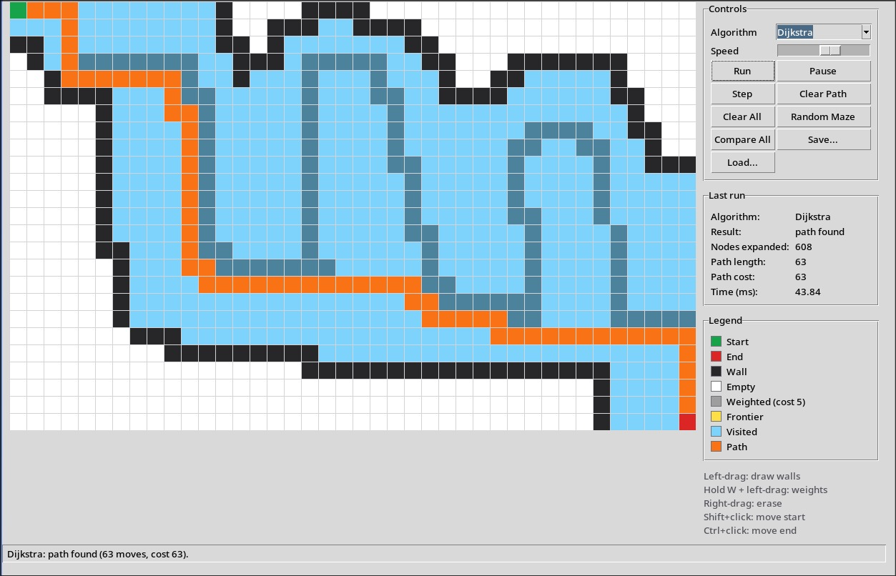

# Pathfinding Visualizer

An interactive visualizer for classic grid pathfinding algorithms, built with
Python 3 and **only the standard library** (tkinter, heapq, collections, json,
random, time). Draw walls and weighted cells, generate mazes, and watch BFS,
DFS, Dijkstra and A* explore the grid step by step.



## Features

- **Four algorithms**, each written as a Python generator that yields after
  every node expansion:
  - **BFS**: shortest path in number of moves; ignores weights.
  - **DFS**: finds *a* path, usually not the shortest; ignores weights.
  - **Dijkstra**: minimum-cost path; respects weights.
  - **A\***: minimum-cost path with the Manhattan heuristic; respects weights
    and usually expands far fewer nodes than Dijkstra.
- **Non-blocking animation**: steps are pulled from the generator with
  `canvas.after()`, so the window stays responsive. Run, Pause and
  single-Step through any search, and adjust the speed while it runs.
- **Weighted cells**: hold <kbd>W</kbd> while drawing to place cells that cost
  5 to enter. They are drawn darker.
- **Random mazes** generated with recursive backtracking.
- **Stats panel** after every run: nodes expanded, path length, path cost and
  time in ms.
- **Compare mode** runs all four algorithms on the current grid without
  animation and shows the results side by side in a table.
- **Save / Load** the grid (walls, weights, start, end) as JSON.
- A distinct color for each cell state, plus a legend.





## Requirements

- Python 3.8 or newer
- tkinter. It ships with the python.org installers for Windows and macOS. On
  Linux you may need to install it separately, e.g. `sudo apt install python3-tk`
  (Debian/Ubuntu) or `sudo pacman -S tk` (Arch).

No third-party packages are needed.

## Running

```bash
python main.py
```

(Use `python3 main.py` if `python` points to Python 2 on your system.)

## Controls

| Action | Input |
| --- | --- |
| Draw walls | Left-click and drag |
| Draw weighted cells (cost 5) | Hold <kbd>W</kbd> + left-click and drag |
| Erase walls/weights | Right-click and drag |
| Move start node | <kbd>Shift</kbd> + click |
| Move end node | <kbd>Ctrl</kbd> + click |
| Start or resume the search | **Run** |
| Pause the animation | **Pause** |
| Advance one expansion | **Step** |
| Remove visited/frontier/path cells | **Clear Path** |
| Remove everything except start/end | **Clear All** |
| Generate a maze | **Random Maze** |
| Compare all four algorithms | **Compare All** |
| Save/load the grid as JSON | **Save...** / **Load...** |

The grid can't be edited while a search is running or paused; press
**Clear Path** first. Editing after a finished search clears the old path
automatically.

## Colors

| State | Color |
| --- | --- |
| Start | green |
| End | red |
| Wall | near-black |
| Empty | white |
| Weighted | a darker shade of the cell's normal color |
| Frontier (queued, not yet expanded) | yellow |
| Visited (expanded) | light blue |
| Path | orange |

## How the stats are measured

- **Nodes expanded**: how many nodes were taken off the frontier and had
  their neighbors examined, including the end node.
- **Path length**: number of moves from start to end.
- **Path cost**: sum of the weights of every cell entered after the start
  (normal cells cost 1, weighted cells cost 5). On a grid without weights it
  equals the path length.
- **Time (ms)**: time spent inside the algorithm itself. For animated runs,
  animation delays and drawing are excluded, so the number is comparable to
  compare mode.

## Algorithms and complexity

V is the number of cells and E the number of neighbor connections (at most 4V).

| Algorithm | Data structure | Weights | Optimal | Time |
| --- | --- | --- | --- | --- |
| BFS | FIFO queue | ignored | fewest moves | O(V + E) |
| DFS | LIFO stack | ignored | no | O(V + E) |
| Dijkstra | binary heap on g(n) | respected | minimum cost | O((V + E) log V) |
| A* | binary heap on g(n) + h(n) | respected | minimum cost | O((V + E) log V) worst case |

A* uses the Manhattan distance as its heuristic. Every move costs at least 1,
so the heuristic never overestimates and A* stays optimal on weighted grids.

## Save file format

```json
{
  "version": 1,
  "rows": 25,
  "cols": 40,
  "start": [12, 10],
  "end": [12, 29],
  "walls": [[3, 4], [3, 5]],
  "weights": [[7, 8, 5]]
}
```

Positions are `[row, col]`; weights are `[row, col, weight]`.

## Project structure

```
main.py        entry point
grid.py        Grid and Node classes, maze generation, JSON save/load
algorithms.py  BFS, DFS, Dijkstra and A* as step-by-step generators
gui.py         tkinter App: canvas, controls, stats, legend, compare table
```
